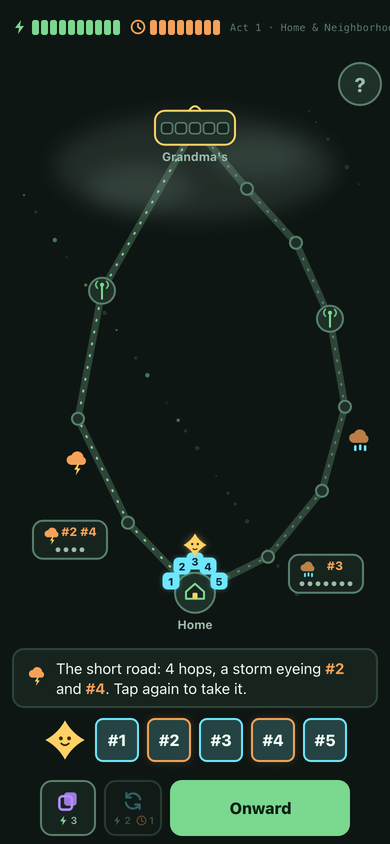
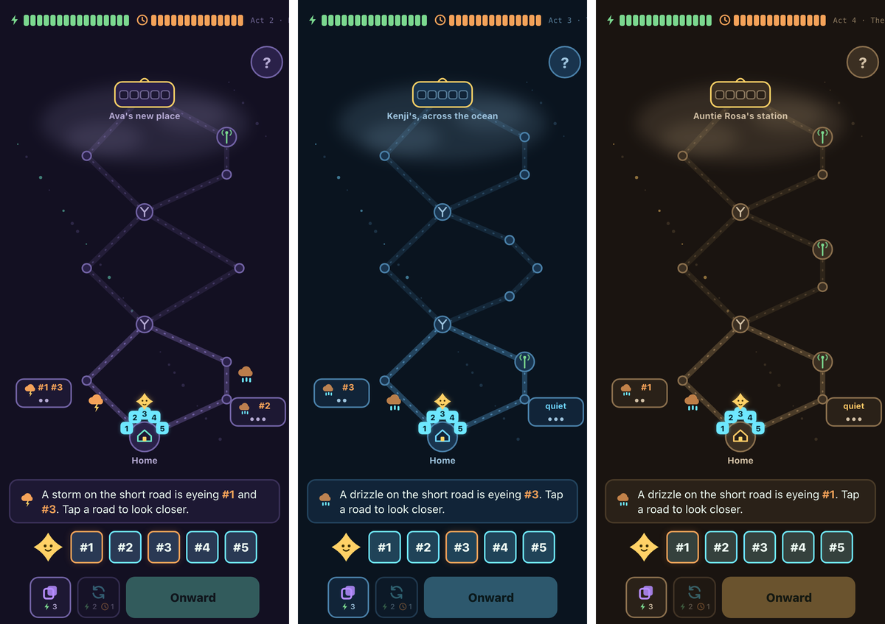

# Packet Run

**A roguelite for ages 9–12 where real networking is the game mechanics.**

You're a message trying to get home. You shatter into five packet-fragments, journey across the physical internet — storms, corruption, congestion, sniffers, oceans — and if enough of you arrives, in one piece and in order, the message *renders*.

---

**[Play it](https://maninae.github.io/packet-run/)** | **[For grown-ups](https://maninae.github.io/packet-run/teachers.html)** | **[Playtest kit](PLAYTEST.md)**

No lectures, no quizzes. You don't read about retransmission — you lose a fragment to a storm and re-send it to win. Every tool is a real networking verb, every hazard a real phenomenon, every route a real tradeoff. The design law is [**never teach a falsehood**](design/07-accuracy.md): simplify, dramatize, personify — but never plant an idea a kid has to unlearn later.

- **Five acts, five people waiting**: Grandma's birthday note, Ava's new apartment, pen-pal Kenji across the ocean, Auntie Rosa on the mesh her neighbors built — and Grandma again, with the Static in between. The act ladder is the curriculum: congestion enters with the city, undersea cables with the ocean, the finale is the entity behind every corruption zone.
- **Two payloads, opposite tempos**: the birthday message (every piece matters) vs. the live call (keep it moving, skip what's stale). That felt contrast *is* TCP vs UDP — named only after the final boss, as words for strategies the player already invented.
- **No unwinnable maps, ever**: every generated map is beaten by a scripted policy inside the generator before it's served. Fairness is structural, not statistical.
- **Losses teach**: every failure ends in an honest autopsy — what struck, which idea beat you, which tool answers it, and how the real internet handles the same problem.
- **Wins travel**: a win becomes a text card with an emoji journey and a challenge link — same map, same seed, your friend's moves against yours.

<p align="center">
  
</p>

The world changes as you climb — neon dusk in Backbone City, deep blues on the Ocean Crossing, ochre skies in the Far Reaches:

<p align="center">
  
</p>

## Play

No build step, no dependencies, no accounts. Any static server:

```sh
python3 -m http.server
# open http://localhost:8000 — on a phone, use your machine's LAN address
```

Portrait phone is the primary target; desktop derives from it.

## What it teaches

| In the game | On the real internet |
|---|---|
| The message splits into 5 racing fragments | Packet switching; independent routes, out-of-order arrival |
| Duplicate & Retransmit | Reliability is *built*, not assumed |
| Checksum & Repair vs the Static | Error detection; receivers checksum everything |
| The jammed pipe's send-rate choice | Congestion control — slow start, backing off |
| The Encryption Cloak | Encryption in transit: visible but unreadable |
| The address book beat | DNS, and why caching makes the second visit faster |
| The swarm that starves a pipe | DDoS: floods exhaust shared capacity |
| The Far Reaches' sparse grid | The digital divide — underinvestment, never the people |

The full table, the accuracy commitments, and co-play guidance live on [the grown-ups page](teachers.html).

## How it works

```
createRun / legalActions / act        one headless engine drives everything
        │
        ├── the browser UI            (SVG map, canvas party, WebAudio sfx — all drawn in code)
        ├── the full test suite       (node:test + Playwright, portrait & desktop)
        ├── Monte-Carlo economies     (four player temperaments × 1500 runs — balance is simulated, not guessed)
        └── the map generator          (every candidate map replayed & verified winnable before serving)
```

Numbers live in [`js/config.js`](js/config.js) and mirror the [design docs](design/README.md), which record seven review rounds and every gate the game passed on its way here.

```sh
node --test tests/unit/*.test.js    # engine, economy simulations, balance
node --test tests/e2e/*.test.js    # Playwright end-to-end
```

## Privacy

No accounts, no tracking, no analytics, no ads. Progress lives in the browser's local storage only. Share cards are plain text containing a map seed, never personal data.

## License

MIT © Owen Wang
